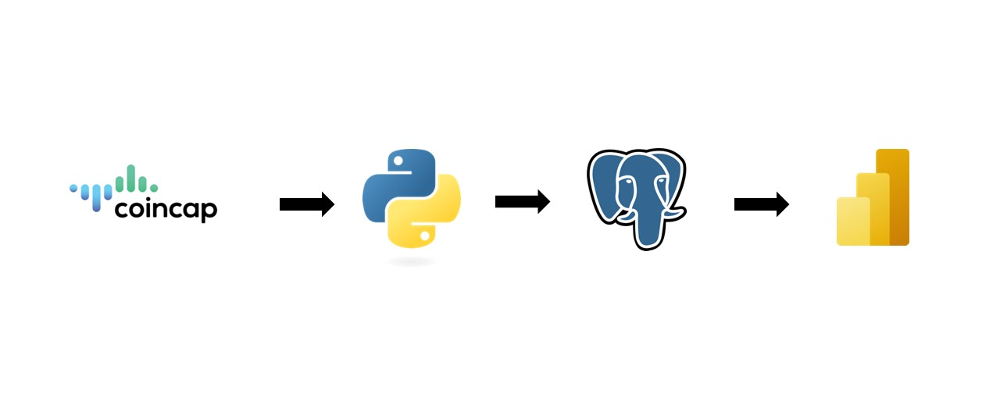

# End-to-End Analytics Pipeline - API to Power BI

This project extracts cryptocurrency data from the CoinCap API for the last 24 hours and builds an interactive dashboard using Power BI. The workflow involves data extraction, transformation, and storage to provide meaningful insights into the cryptocurrency market.

## Workflow

1. **CoinCap API** is used as the data source to gather cryptocurrency data for the last 24 hours.
2. **Python** is used for data ingestion and transformation to clean and prepare the data.
3. **PostgreSQL** is used to store the transformed data in a structured format.
4. **Power BI** is used for analytics and creating the dashboard, providing visualizations of the cryptocurrency market trends.

## Technologies Used

- **CoinCap API** for cryptocurrency data
- **Python** for data ingestion and transformation
- **PostgreSQL** for data storage
- **Power BI** for creating the dashboard and visualizations

